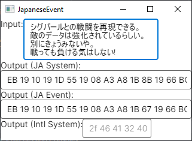
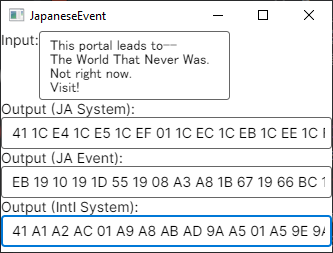

# Kh2Codecs

Uses code from [OpenKh](https://github.com/Xeeynamo/OpenKh/tree/8a88fd78beeeba93605b9bbc8f72a84f449b042b/OpenKh.Kh2/Messages)
and builds an Avalonia UI around it for quick serde of Kh2 messages.

## Example: Japanese to Bytes

## Example: Bytes to English

